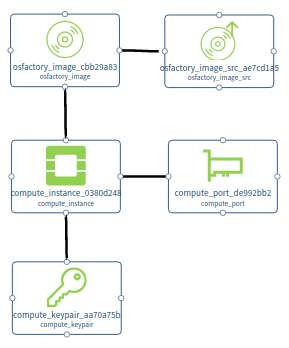
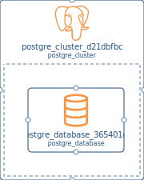
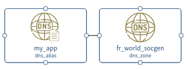
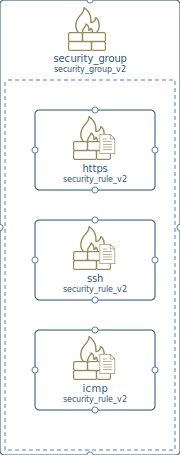
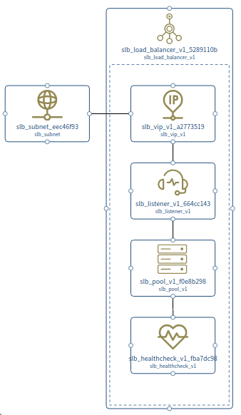
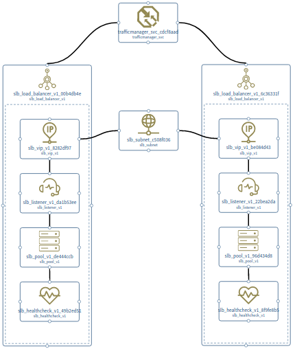
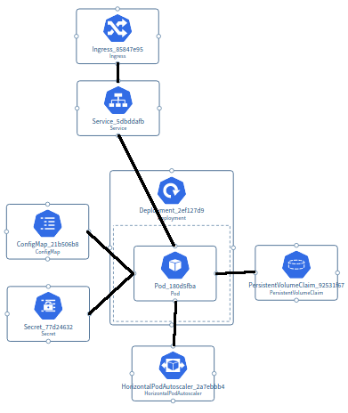
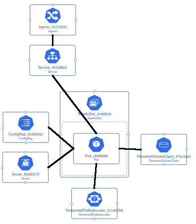
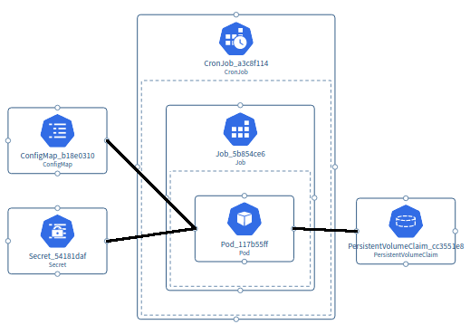

# Liste des templates ACID

Voici des exemples de templates qui pourraient servir pour l'équipe **ACID**.

Les templates sont rangés selon **trois catégories** :

1. **Templates de projet :** qui peuvent servir de base pour créer un nouveau projet.
2. **Templates de modèle :** qui peuvent servir de base pour créer un nouveau modèle (pipeline ou infra).
3. **Templates de composants :** qui peuvent être ajoutés dans un modèle existant (pipeline ou infra).

## 1. Templates de projet

### Projet Terraform+Ansible+Jenkins

1. Projet Terraform+Ansible+Jenkins - **Java**
    - Exemple : https://github.com/viennem/demo-iac-gitops
2. Projet Terraform+Ansible+Jenkins - **JavaScript**
    - Exemple : https://github.com/viennem/demo-iac-gitops
3. Projet Terraform+Ansible+Jenkins - **Python**
4. Projet Terraform+Ansible+Jenkins - **.NET**

Qid des projet avec plus d'un microservices ?

### Projet Kubernetes+Docker+Jenkins

1. Projet Kubernetes+Docker+Jenkins - **Java**
2. Projet Kubernetes+Docker+Jenkins - **JavaScript**
    - Exemple: https://github.com/viennem/demo-k8s
3. Projet Kubernetes+Docker+Jenkins - **Python**
4. Projet Kubernetes+Docker+Jenkins - **.NET**

## 2. Templates de modèle

### Pipelines

#### CI (Jenkins)

1. **"Java CI"** : Pipeline de CI pour builder une application Java.
2. **"JavaScript CI"** : Pipeline de CI pour builder une application JavaScript.
3. **"Python CI"** : Pipeline de CI pour builder une application Python.
4. **".NET CI"** : Pipeline de CI pour builder une application .NET.

SonarQube ?

#### CD (Jenkins)

1. **"Terraform CD"** : Pipeline de CD pour déployer sur Terraform.
2. **"Kubernetes CD"** : Pipeline de CD pour déployer sur Kubernetes.
2. **"Kubernetes CD + Vault integration"** : Pipeline de CD pour déployer sur Kubernetes en injectant des secrets Vault.

### Infrastructure

#### Terraform

#### Kubernetes

## 3. Templates de composants

### Pipelines

#### CI (Jenkins)

Composants de CI :

Aucun template de composants de CI nécessaire.

<b>[Résolu] Incertitude</b>

As-t-on besoin de templates de CI ? => cela va dépendre du fonctionnement des composants dans le plugin Jenkinator

- Si les composants comme "Build / Test" sont spécifiques (avec un composant différent par language), alors il n'y aura pas besoin de templates de CI.
- Si les composants sont génériques (exemple : un seul composant "Build / Test" générique), alors on aura besoin de templates pour décliner les composants génériques en templates spécifiques par langauge, exemple :
  1. **"Build / Test - Java"** : Composant "Build / Test" pré-configuré avec les commandes pour builder une application Java.
  2. **"Build / Test - JavaScript"** : Composant "Build / Test" pré-configuré avec les commandes pour builder une application JavaScript.
  3. **"Build / Test - Python"** : Composant "Build / Test" pré-configuré avec les commandes pour builder une application Python.
  4. **"Build / Test - .NET"** : Composant "Build / Test" pré-configuré avec les commandes pour builder une application .NET.
  5. Idem pour **"Sonar Analysis"** décliné en languages (Java et JavaScript seulemment) ?
  6. Idem pour **"Automatic Version Retrieval"** décliné en languages  (Java et JavaScript seulemment)  ?

**Réponse :** Les composants seront spécifiques, donc il n'y aura pas besoin de templates,
car cela permettra de simplifier la configuration des attributs des composants au lieu d'avoir des noms d'attributs génériques.

<b>Autres questions en dehors des templates</b>

- Attribut language au niveau du composant pipeline, ou au niveau de chaque composant (Build/Test, Version Retrival, Sonar Analysis) ?
    - Qid des pipelines multi-languages ?

#### CD (Jenkins)

Composants de CD :

Aucun template de composants de CD nécessaire.

### Infrastructure

#### Terraform

1. **"OCS Compute"** : OCS Compute instance et ses dépendances.
   

Afficher

2. **"OCS Compute + Block Storage"** : OCS Compute instance et ses dépendances + block storage attaché.
   

Afficher
 <b>TODO:</b> composants à ajouter dans les metadata de Terraform

3. **"OCS Compute + File Storage"** : OCS Compute instance et ses dépendances + file storage attaché.
   

Afficher
 <b>TODO:</b> composants à ajouter dans les metadata de Terraform

4. **"OCS Compute + Block & File Storage"** : Compute instance et ses dépendances + block et file storage attachés.
   

Afficher
 <b>TODO:</b> composants à ajouter dans les metadata de Terraform

5. ~~"Postgres Cluster" : Cluster postgres et une database.~~
   

Afficher

6. ~~"DNS Alias" : Alias DNS avec zone DNS.~~
   

Afficher

7. **"Security Group"** : Security group avec règles HTTPS+SSH+ICMP.
   

Afficher

8. **"SLB Load-Balancer"** : Load-balancer et sous-composants.
   

Afficher

9. **"Traffic Manager"** : Traffic manager et deux load-balancers (multi-az ou multi-régions).
   

Afficher

10. ~~"File Storage" : Consistency Group + Filesystem~~
11. **"Object Storage"** : Access Key + Bucket + Policy + Group.
12. **"RabbitMQ"** : RabbitMQ broker + user + vhost.
13. **"Certificate"** : Certificat pré-configuré avec les champs subject de la SG.
14. **"VCS Compute"** : VCS Compute instance et ses dépendances.
15. **"VCS Compute + Block Storage"** : VCS Compute instance et ses dépendances + block storage.
16. **"VCS Compute + File Storage"** : VCS Compute instance et ses dépendances + file storage.
17. **"VCS Compute + Block & File Storage"** : VCS Compute instance et ses dépendances + block et file storage.

Composants manquants dans le plugin

- Storage :
    - Block Storage :
        - `compute_volume`, `compute_volume_attachement`
    - File Storage :
        - `files_consistency_group`, `files_filesystem`, `files_nfs_client`
    - Object Storage :
        - `object_storage_access_key`, `object_storage_bucket`, `object_storage_group`, `object_storage_rights_policy`, `object_storage_replication_policy`, `object_storage_bucket_replication`
- PaaS :
    - Rabbitmq :
        - `rabbitmq_broker`, `rabbitmq_user`, `rabbitmq_vhost`
    - Certificates :
        - `pki_certificate_subject`
    - Oracle :
        - `oracle_database`
- Autres :
    - `vcs_server`
    - `compute_server_group`
    - `os_configuration_module`
    - `slb_http_policy`, `slb_certificate`
    - `traffic_manager_healthcheck`
    - Read vault secret
- Pas nécessaire ?
    - Kubernetes workspace
    - Airflow instance
    - Secrets (create secret)
    - MyVault namespace
    - Monitoring
    - Metrology
    - Showback
    - IAM client (create client_id, client_secret)

Questions :

- "OCS/VCS Compute" : 4 variations -> faut-il garder seulement la variation la plus complète, dans la logique où il est plus facile de supprimer le trop que de rajouter ? (comme pour Kubernetes)
    - Idem pour load-balancer / traffic manager
    - Ajouter un security group dans les 4 variations ?
- Supprimer les templates barrés (Postgres cluster, DNS Alias, File Storage) ?

#### Kubernetes

1. **"Deployment++"** : `Deployment` + `Service` + `Ingress` + `PersistentVolumeClaim` + `ConfigMap` + `Secret` + `HorizontalPodAutoscaler`.
   

Afficher

2. **"StatefullSet++"** : `StatefullSet` + `Service` + `Ingress` + `PersistentVolumeClaim` + `ConfigMap` + `Secret` + `HorizontalPodAutoscaler`.
   

Afficher

3. **"CronJob++"** : `CronJob` + `PersistentVolumeClaim` + `ConfigMap` + `Secret`.
   

Afficher

